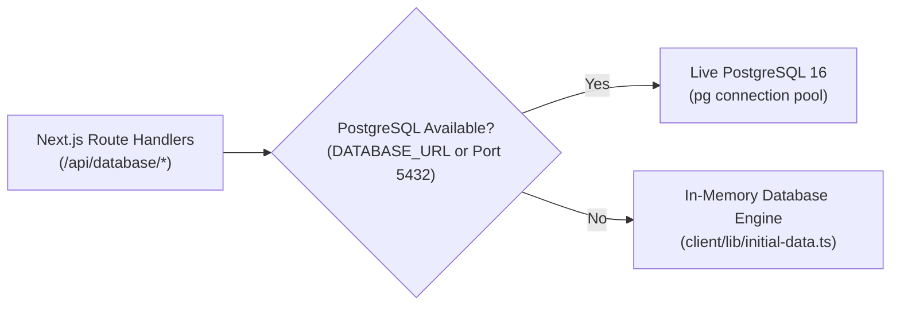

# NebulaX Railway Dispatch & Planning Studio (Client Frontend)

An enterprise-grade, interactive railway possession planning, capacity management, and dispatch platform built with **Next.js 16 (App Router), React 19, and Tailwind CSS v4**.

The client coordinates maintenance workloads, capital renewals, safety exclusion zones, and track allocations across a dense multi-line railway network. It provides real-time visualization of 1D spatial safety envelopes, predecessor DAG graph audits, multi-scenario CP-SAT optimization triggers, and comprehensive schedule Gantt analytics.

---

## 1. Quickstart & Local Development

### Prerequisites
- Node.js 22 LTS or later
- npm or pnpm

### Development Server
```bash
cd client
npm install
npm run dev
```

Open your browser and navigate to:
👉 **`http://localhost:3000`**

### Production Build & Local Validation
```bash
cd client
npm run build
npm start
```
The application compiles into an optimized **Next.js standalone runner** (`output: standalone`) ready for containerization.

---

## 2. Core Application Pages & Features

### 1. Executive Dashboard (`/`)
- High-level KPIs: Active Lines, Station Nodes, Track Sectors, Commercial Contracts, and Planned Work Volume.
- Quick-launch cards into the **Schedule Dispatch Studio**, **Database Console**, and **Scenario Ingestion Engine**.
- Real-time backend status badge indicating PostgreSQL and FastAPI engine connectivity.

### 2. Schedule Dispatch & Gantt Studio (`/schedule`)
- **30-Week Interactive Gantt Matrix**: Displays week-by-week and night-by-night (Sunday–Saturday) access allocations.
- **Contract Milestone Tracker**: Monitors planned completion dates vs. actual completion nights, tracking earliness and lateness.
- **Capacity Heatmap Overlay**: Visualizes sector and station platform physical supply usage, highlighting bottleneck links (`Cap: 1` single-track shared links).
- **Live Solver Trigger**: Directly dispatches CP-SAT optimization requests for **Scenario A**, **Scenario B**, or **Scenario C** with customizable search timeouts and real-time execution telemetry.
- **Scorecard & Penalty Breakdown**: Detailed breakdown of weighted delay penalties ($100\times$, $10\times$, $1\times$), excess access night penalties, and ECLO compliance.

### 3. Database Management Studio (`/database`)
- **Interactive Network Topology Viewer**: Visual schematic of Line Alpha (`ALP`) and Line Beta (`BET`), showing bidirectional bounds (`EB` / `WB`), station platforms, tunnel segments, and convergence interchange hubs (`H01`, `H02`).
- **1D Linear Spatial Footprint Bar**: Discrete coordinate track bar ($1 \dots 19$) rendering active working zones, safety buffer envelopes, and opposite-bound live exclusion margins.
- **Contracts & Workloads Data Grid**: Searchable, faceted grid supporting filtering by Line, Priority (`P1`, `P2`, `P3`), Nature (`Live`, `Non-live`), and Bound (`EB`, `WB`). Supports inline cell editing.
- **Predecessor DAG Dependency Graph**: Interactive SVG dependency graph with built-in DFS / Tarjan cycle detection to audit Finish-to-Start ($FS+0$) precedence and warn against circular loops.
- **Entry Creation Drawer**: Wizard for track maintainers to insert urgent `Priority 1` maintenance jobs with automatic safety buffer calculation.
- **Staged Changes Bottom Dock**: Transactional draft dock allowing planners to stage edits, review unified diffs, discard changes, or commit directly to PostgreSQL and trigger re-optimization.

### 4. Custom Dataset Ingestion Engine (`/upload`)
- Multi-file drag-and-drop ingestion accepting official competition CSV sets (`01_LINES.csv` through `08_ACTIVITY_DETAILS.csv`).
- Comprehensive schema validation: checks required headers, data types, foreign keys, and geographic coordinates before loading.
- Seamlessly toggle between the **Official Competition Baseline** and custom uploaded scenario datasets.

### 5. Planning Runs & Audit Log (`/runs`)
- Historical log of optimization runs, recorded solve runtimes, solver termination statuses (`OPTIMAL`, `FEASIBLE`, `TIME_LIMIT`), objective penalty scores, and certified validation certificates.

---

## 3. Dual-Mode Database Adapter Architecture

The client implements a **zero-friction dual-mode database interaction adapter** in [`client/lib/db.ts`](file:///C:/Users/Quan/Desktop/Competitions/NebulaX/nebula/client/lib/db.ts):



- **Live PostgreSQL Mode**: Connects directly to PostgreSQL 16 via connection pooling (`pgPool`). All queries, updates, transactions, and schema inspections execute against live relational tables.
- **Zero-Friction In-Memory Mode**: If PostgreSQL is offline, the client seamlessly falls back to an in-memory database seeded from [`database/init_data/`](file:///C:/Users/Quan/Desktop/Competitions/NebulaX/nebula/database/init_data/). 100% of UI views, API endpoints, topological maps, and DAG cycle checkers operate immediately without requiring Docker or database setup.

---

## 4. Client API Routes Architecture

The Next.js backend routes in `client/app/api/` serve as an API gateway:

| Route | Method | Description |
| :--- | :---: | :--- |
| `/api/database/overview` | `GET` | Returns network statistics, dataset signature, and DAG validity. |
| `/api/database/topology` | `GET` | Returns sectors, platforms, bounds, and supply capacities. |
| `/api/database/activities` | `GET` | Returns activities with faceted query filters (`line`, `priority`, `nature`). |
| `/api/database/dag` | `GET` | Returns dependency nodes, edges, and DFS cycle detection results. |
| `/api/database/parameters` | `GET` | Returns planning horizon dates, buffer policies, and contract rules. |
| `/api/database/commit` | `POST` | Commits uncommitted draft edits to PostgreSQL within a transaction. |
| `/api/database/flush` | `POST` | Wipes and resets the active database tables. |
| `/api/solver/solve` | `POST` | Proxies optimization solve requests to the FastAPI engine (`http://server:8000`). |
| `/api/solver/status` | `GET` | Checks FastAPI engine health and solver process readiness. |
| `/api/disruptions` | `GET`, `POST` | Fetches and stages real-time track disruptions and emergency outages. |

---

## 5. Automated Integration Test Suite

The client includes a self-contained integration test suite testing all endpoints, state stores, and rendering pipelines:

```bash
cd client
npm run test:api
```

### Verified Test Suites:
1. **`GET /api/database/overview`**: Validates 2 lines, 20 stations, 18 sectors, 54 activities, and acyclic DAG.
2. **`GET /api/database/topology`**: Validates 76 capacity records across all tracks and platforms.
3. **`GET /api/database/activities`**: Tests faceted search by Line (`ALP`) and Priority (`P1`).
4. **`GET /api/database/dag`**: Confirms Tarjan cycle detection and clean baseline topology.
5. **`GET /api/database/parameters`**: Verifies 30-week horizon (`2027-01-04`) and 2-sector live safety buffer policies.
6. **`POST /api/database/commit`**: Validates transactional draft commit and persistence.
7. **`POST /api/database/flush`**: Validates clean database reset.
8. **HTML SSR Pipeline**: Validates server-side rendering for `/database` and `/schedule`.

---

## 6. Docker & Production Deployment

### Docker Standalone Image
The production image utilizes a multi-stage Node 22 build, copying only the required standalone bundle and static assets to minimize container size:

```bash
# Build production image
docker build -f Dockerfile.prod -t nebula-client:prod .

# Run standalone container
docker run -p 3000:3000 -e API_INTERNAL_URL=http://server:8000 nebula-client:prod
```

### Live Google Cloud Production Deployment
The client is deployed live on Google Cloud Platform:
- **Public URL**: **[http://136.107.86.146/](http://136.107.86.146/)**
- **Hosting**: Google Compute Engine (`e2-standard-4`, 4 vCPUs, 16 GB RAM) in `us-east4-a`
- **Reverse Proxy**: Nginx 1.22 routing external port 80 traffic to Next.js on port 3000.
