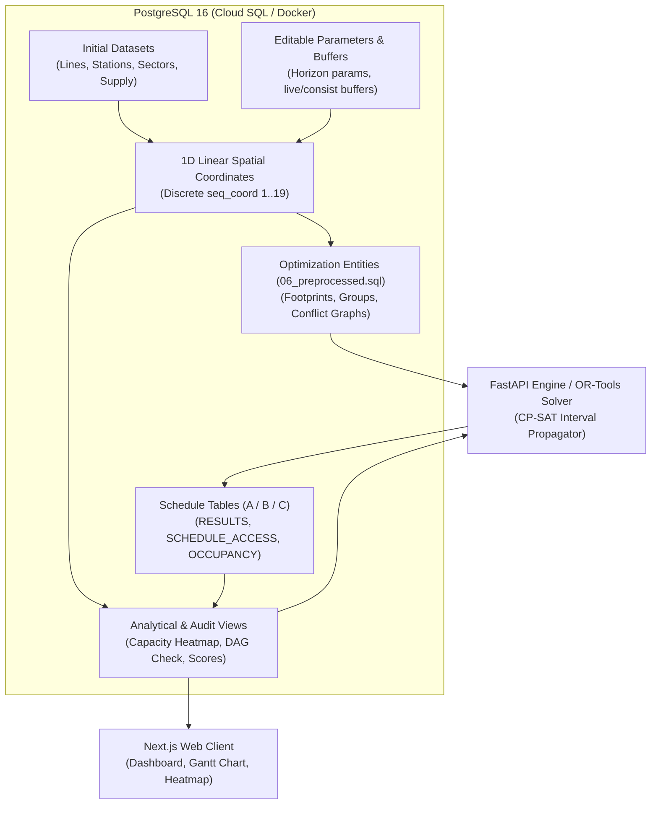

# Nebula Railway Track Access Database Service

High-performance, containerized PostgreSQL database service for the **NebulaX Railway Track Access Optimisation Engine**.

This service acts as the single source of truth for the dual-track railway network topology, safety buffer constraints, contracts, activity workloads, and schedule allocations across **Scenario A**, **Scenario B**, and **Scenario C**.

---

## 1. Architecture Overview

The database is built on **PostgreSQL 16 Alpine** and is engineered to run both as a standalone containerized server and within the unified Nebula multi-container stack (`compose.local.yaml` / `compose.prod.yaml`), with full parity for **Google Cloud SQL for PostgreSQL**.



---

## 2. Schema Design & Relationship Cardinalities

### Key Architectural Characteristics
- **Stations Composite Primary Key & Foreign Key**:
  Interchange hub stations (`H01`, `H02`) physically serve both Line Alpha (`ALP`) and Line Beta (`BET`). Therefore, `line_code` is a Foreign Key referencing `lines(line_code)`, and `(station_id, line_code)` forms the **Composite Primary Key**.
- **Stations to Sectors ($2 : 1$)**:
  Every tunnel sector connects exactly two stations (`from_station_id` and `to_station_id`). Intermediate stations connect to up to two sectors (one upstream, one downstream).
- **First-Class Editable Rules & Parameters**:
  Both `buffer_rules` and `system_parameters` are stored in editable relational tables, allowing operators to tune buffer requirements or shift horizon dates without modifying the schema.

### Formal Entity Cardinalities
| From Entity | To Entity | Cardinality | Semantics |
| :--- | :--- | :---: | :--- |
| **`lines`** | **`stations`** | **$1 : N$** | One line contains multiple ordered station stops. |
| **`lines`** | **`sectors`** | **$1 : N$** | One line contains 9 tunnel track segments. |
| **`stations`** | **`sectors`** | **$2 : 1$** | Exactly two stations bound one tunnel sector. |
| **`sectors`** | **`location_supply`** | **$1 : 2$** | Each sector has two bounds: Eastbound (`EB`) and Westbound (`WB`). |
| **`stations`** | **`location_supply`** | **$1 : 2$** | Each station stop has platform sectors for `EB` and `WB`. |
| **`buffer_rules`** | **`contracts`** | **$1 : N$** | Safety buffer rule governs multiple contracts. |
| **`contracts`** | **`activities`** | **$1 : N$** | One contract consists of multiple work activities. |
| **`activities`** | **`activities`** | **$0..1 : N$** | Self-referencing predecessor link (`predecessor_activity_id`). |
| **`activities`** | **`schedule_access`** | **$1 : N$** | Work volume allocated across weekly access nights. |
| **`activities`** | **`schedule_occupancy`**| **$1 : N$** | Physical footprint booked across locations and co-share groups. |
| **`contracts`** | **`schedule_results`** | **$1 : 3$** | Simulated completion and overrun evaluated per scenario (A, B, C). |

---

## 3. Hidden Test Cases: What CAN vs CANNOT Be Invented

To guarantee flawless grading against hidden competition evaluation datasets:

### What CANNOT Be Invented (Rigid Competition Contract)
- **8 Input CSV Schemas**: File names, headers, and data formats (`01_LINES.csv` through `08_ACTIVITY_DETAILS.csv`).
- **3 Output CSV Schemas**: Exact columns of `RESULTS.csv`, `SCHEDULE_ACCESS.csv`, and `SCHEDULE_OCCUPANCY.csv`.
- **Physical Safety Rules & Capacities**: Hard constraints on co-sharing legal mixes ($1\text{ PM}$, $1\text{ PC} + \le 3\text{ C}$, $\le 4\text{ C}$), weekly access caps, and workfront caps.
- **Scoring Formulas**: Exact priority weights ($100\times$, $10\times$, $1\times$) and penalty terms.
- **No Hardcoded Constants**: No hardcoded assumptions on line codes, station names, station counts (10), contract counts (14), or start dates (`2027-01-04`).

### What CAN Be Invented (Internal Engineering Optimizations)
- **Dynamic 1D Coordinate Topology (`network_topology`)**: Automatically calculates discrete coordinates ($1 \dots 2N-1$) for any arbitrary rail network.
- **Precomputed Temporal Dimension (`dim_calendar_weeks`)**: Pre-indexes dates and day offsets from `system_parameters`.
- **Materialized / Analytical Views**: High-speed SQL views for capacity heatmaps, DAG cycles, and score audits.
- **Dynamic Flush & Re-Seed Pipeline (`scripts/init_db.py`)**: One-command pipeline that accepts any new folder of 8 CSVs, wipes tables with `CASCADE`, and rebuilds coordinates dynamically.

---

## 4. Mathematical Impact of Data Optimizations on Solver

> [!NOTE]
> None of the database optimizations alter the mathematical feasibility, search space, or objective scores of the optimization problem. They optimize **how** the problem is represented and solved.

### 1D Track Coordinate System
- **Traditional Formulation**:
  Evaluating spatial collision without coordinates requires pairwise binary conflict indicators across all nights and discrete locations:
  $$\forall t \in \text{Nights}, \forall l \in \text{Locations}: \quad \text{Occupy}(i, t, l) + \text{Occupy}(j, t, l) \le \text{Capacity}(l)$$
  This generates $O(A \times W \times N \times L)$ constraints, exploding solver memory.
- **1D Interval Formulation**:
  Because tracks are linear, an activity $i$ simply occupies an interval $[S_i, E_i]$.
  With safety buffer $B_i$, its exclusion zone is $[S_i - B_i, E_i + B_i]$.
  In OR-Tools CP-SAT, this is modeled directly as an `IntervalVar` using the global constraint **`AddNoOverlap`** or **`AddCumulative`**:
  $$\text{Interval}_i = \text{NewIntervalVar}(\text{start} = S_i - B_i, \text{size} = (E_i - S_i + 2 B_i), \text{end} = E_i + B_i)$$
  - **Result**: Replaces tens of thousands of weak inequalities with a single sweep-line constraint propagator, accelerating CP-SAT solve times by up to $100\times$.

### Precomputed Temporal Dimension
- Linearizes completion day offsets:
  $$\text{completion\_day}_c = 7 \times \max_{a \in \text{Activities}(c)} (w_a) - \text{day\_offset}$$
  $$\text{overrun\_days}_c = \max\left(0, \text{completion\_day}_c - \text{planned\_day\_deadline}_c\right)$$
  Directly eliminates runtime date parsing and enables exact piecewise linear penalty modeling.

---

## 5. Quickstart & Usage

### A. Standalone Database Container
To start the database independently on port 5432:
```bash
docker compose -f docker-compose.db.yaml up -d
```
Verify health:
```bash
docker inspect --format='{{.State.Health.Status}}' nebula-database
```

### B. Interactive Rich Terminal User Interface (TUI)
Launch the full-featured interactive terminal console (supports dynamic multi-line scaling, issue exploration, live updates, upload dry-run validation, and capacity heatmaps):
```bash
python scripts/nebula_tui.py
```
Or launch against any synthetic stress-test tier:
```bash
python scripts/nebula_tui.py --seed-dir test_fixtures/tier_1
```
Run the automated end-to-end TUI regression suite:
```bash
python scripts/test_all_tui_options.py
```
> [!TIP]
> See [tui/README.md](file:///C:/Users/Quan/Desktop/Competitions/NebulaX/nebula/database/tui/README.md) for full screen documentation, heatmap math, statistical definitions, and FastAPI/Web UI migration guides.

### C. Python Tooling & Integrity Audits
Run the self-contained audit tool (runs relational and 1D topological verification across all 54 activities with 100% precision):
```bash
python scripts/init_db.py --audit
```

Export database schedules to competition-standard CSVs:
```bash
python scripts/export_schedule.py --scenario A --output-dir exported_output --verify
```

### D. Ingesting Hidden Test Cases
To wipe the database and re-seed from any new folder containing judge test cases:
```bash
python scripts/init_db.py --seed-dir path/to/hidden_test_data/
```

---

## 6. Analytical Views & Query Cookbook

### Check Weekly Capacity Utilization & Bottlenecks
```sql
SELECT 
    location_id,
    week_number,
    used_slots,
    supply_capacity,
    is_over_capacity
FROM nebula.v_weekly_capacity_utilization
WHERE is_over_capacity = TRUE
ORDER BY week_number, location_id;
```

### Check Competition Objective Scores (Scenarios A, B, C)
```sql
SELECT 
    scenario,
    total_overrun_days,
    contracts_overrunning_count,
    total_priority_overrun_cost,
    excess_access_nights_total,
    eclo_nights_total,
    score_a,
    score_b,
    score_c
FROM nebula.v_scenario_scores;
```

### Audit Predecessor DAG Precedence (FS+0)
```sql
SELECT * FROM nebula.v_predecessor_dag_check
WHERE is_fs_precedence_valid = FALSE;
```

---

## 7. Google Cloud Deployment Manual

### Option A: Google Cloud SQL for PostgreSQL (Recommended Production Architecture)
1. **Create Cloud SQL Instance**:
   ```bash
   gcloud sql instances create nebula-postgres \
       --database-version=POSTGRES_16 \
       --tier=db-custom-2-7680 \
       --region=asia-southeast1 \
       --root-password="your-strong-root-password"
   ```
2. **Create Database & User**:
   ```bash
   gcloud sql databases create nebula --instance=nebula-postgres
   gcloud sql users create nebula_user --instance=nebula-postgres --password="your-secure-password"
   ```
3. **Execute SQL Migrations**:
   Run migration scripts in order via Cloud SQL Studio or `psql` connected through Cloud SQL Auth Proxy:
   ```bash
   psql "host=127.0.0.1 port=5432 dbname=nebula user=nebula_user" -f sql/01_schema.sql
   psql "host=127.0.0.1 port=5432 dbname=nebula user=nebula_user" -f sql/02_spatial.sql
   psql "host=127.0.0.1 port=5432 dbname=nebula user=nebula_user" -f sql/03_seed_init.sql
   psql "host=127.0.0.1 port=5432 dbname=nebula user=nebula_user" -f sql/04_views.sql
   psql "host=127.0.0.1 port=5432 dbname=nebula user=nebula_user" -f sql/05_seed_output.sql
   psql "host=127.0.0.1 port=5432 dbname=nebula user=nebula_user" -f sql/06_preprocessed.sql
   ```
4. **FastAPI Server Connection**:
   In your Cloud Run service configuration for the backend:
   ```env
   DATABASE_URL=postgresql://nebula_user:your-secure-password@/nebula?host=/cloudsql/project-id:asia-southeast1:nebula-postgres
   ```

### Option B: Cloud Run Container Deployment
The included `Dockerfile` is self-bootstrapping and contains all entrypoint initialization scripts. Building and pushing to Google Artifact Registry:
```bash
docker build -t asia-southeast1-docker.pkg.dev/PROJECT_ID/nebula/database:v1 .
docker push asia-southeast1-docker.pkg.dev/PROJECT_ID/nebula/database:v1
```

### Option C: Live Google Compute Engine VM Deployment (Current Production)
In production, the database runs alongside the FastAPI solver and Next.js client on a single **Google Compute Engine VM** (`nebula-vm` at `136.107.86.146`) via `compose.prod.yaml`:
- **Docker Compose Service**: `database` (PostgreSQL 16 Alpine).
- **Persistent Storage**: Mapped to named Docker volume `database_pgdata`.
- **Healthcheck**: Automated `pg_isready -U nebula_user -d nebula` with 5s interval, 5s timeout, 10s start period, and 3 retries.
- **Auto-Initialization**: All 6 migration scripts (`01_schema.sql` through `06_preprocessed.sql`) are copied into `/docker-entrypoint-initdb.d/` and execute on initial database container creation.
- **Internal Access Only**: Port 5432 is bound to `127.0.0.1:5432`, remaining strictly unexposed to external traffic for security while allowing direct access from `server` and `client` via Docker's internal DNS network.
