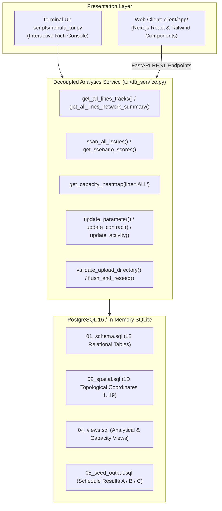

# NebulaX Interactive Database Terminal & Web UI Migration Guide

This module provides a rich, decoupled, and highly portable operational and visualization interface for the railway access database. Powered 100% by Python's `rich` library with high-contrast cross-platform styling, it delivers the full suite of interactive tools expected of the eventual Web GUI:
- **Dynamic Multi-Line Network Visualizer** ($N \ge 2$ lines, automatic interchange discovery, side-by-side comparator)
- **Schedule Results & Violation Explorer** (Exact penalty math, DAG cycle detection, contract delays)
- **Weekly Capacity Utilization Heatmaps** (Individual lines and unified ALL-lines matrix)
- **Database Update Studio** (Live editing of parameters, buffers, contracts, and activities)
- **Database Operations Manager** (Pre-flight dry-run upload validation, flushing, and competition CSV export)

---

## 1. System Architecture

The visualization and operational system is organized into three decoupled layers:



Because `db_service.py` returns pure Python primitives (dicts, lists, ints, strings), it has **zero terminal dependencies**. FastAPI endpoints can invoke `DBAnalyticsService` methods directly to serve JSON payloads to the Next.js web client.

---

## 2. Launching & Using the Terminal User Interface (TUI)

### Interactive Mode
Launch the application:
```bash
python scripts/nebula_tui.py
```
Or launch against any custom or stress-test dataset:
```bash
python scripts/nebula_tui.py --seed-dir test_fixtures/tier_1
```

### Application Navigation & Screen Directory

| Key | Screen / Action | Functionality & Results Integration |
| :---: | :--- | :--- |
| `[1]` | 🗺️ **Multi-Line Network Visualizer** | Dynamically discovers all $N$ lines in the database (`ALP`, `BET`, `GAM`, `DEL`, `EPS`). Shows interchange hubs (`H01`, `H02`), live week-by-week track occupancy (`0/4 Idle`, `1/1 Full`, `OVER`), stacked tracks, and an interactive side-by-side line comparator (`[C]`). |
| `[2]` | ⚠️ **Issue & Violation Explorer** | **Full Schedule Results Inspection**: Scans and details every schedule violation. Computes exact contract overrun days and penalty points ($14\text{ days} \times 1\text{ pt} = 14\text{ pts}$), DAG precedence violations ($FS+0$), circular dependency cycles, capacity bottlenecks, and ECLO non-compliance. |
| `[3]` | 🩺 **Diagnostics & Health Dashboard** | System integrity audit: table record populations across all 12 tables, foreign key integrity, 1D topological continuity ($1 \dots 19$), and calendar horizon synchronization. |
| `[4]` | ✏️ **Database Update Studio** | Live form-driven editor: edit system parameters (`horizon_weeks`, `horizon_start` with automatic calendar re-indexing), safety buffer rules, contract workfronts/maximum access/deadlines, and activity priorities. |
| `[5]` | 🔄 **Database Operations Manager** | **Upload New Database** with **pre-flight dry-run validation** (checks CSV headers, FK consistency, and DAG cycles before committing); **Flush Database** (clean table wipe); and **Export Official Results CSVs** (`RESULTS.csv`, `SCHEDULE_ACCESS.csv`, `SCHEDULE_OCCUPANCY.csv`). |
| `[6]` | 📊 **Capacity Heatmap** | 2D matrix of physical locations vs weeks ($1 \dots 30$). Offers views for individual lines or a unified `ALL` lines matrix. Flags bottlenecks and maxed-out segments. |
| `[7]` | 🔍 **Activity Footprint Inspector** | 1D topological track interval bar showing active working span `[####]` and safety exclusion envelopes `[~~~~]` for any activity. |
| `[8]` | 🏆 **Scenario Penalty Scores & Breakdown** | **Schedule Results Scorecard**: Side-by-side comparison of Scenarios A, B, and C with overrun days, excess nights, and total penalty scores. |
| `[S]` | 🔀 **Switch Active Scenario** | Toggle active evaluation context between `[A]`, `[B]`, and `[C]`. |
| `[B]` | 🧭 **Toggle Bound** | Switch view between Eastbound (`EB`) and Westbound (`WB`). |
| `[Q]` | 🚪 **Exit Application** | Clean terminal exit. |

---

## 3. How the Capacity Heatmap Works (In Simple Terms)

### Where Does the Heatmap Data Come From?
The heatmap is a **2D spatial-temporal matrix** that combines two sources of data:
1. **Supply Side (`location_supply`)**: The physical capacity of each track segment (how many concurrent train maintenance work groups can legally occupy that segment simultaneously).
2. **Demand / Schedule Side (`schedule_occupancy`)**: The actual schedule allocations produced by the solver (or provided in `SCHEDULE_OCCUPANCY.csv`).

### The SQL Logic Behind It
Under the hood, SQL view `nebula.v_weekly_capacity_utilization` joins physical locations with calendar weeks and counts active bookings:
```sql
SELECT 
    l.location_id,
    w.week_number,
    COALESCE(COUNT(o.activity_id), 0) AS used_slots,
    l.supply_capacity,
    CASE WHEN COUNT(o.activity_id) > l.supply_capacity THEN TRUE ELSE FALSE END AS is_over_capacity
FROM location_supply l
CROSS JOIN dim_calendar_weeks w
LEFT JOIN schedule_occupancy o 
    ON l.location_id = o.location_id 
    AND w.week_number = o.week_number
GROUP BY l.location_id, w.week_number, l.supply_capacity;
```

### Visual Representation
- **Y-Axis (Rows)**: Sequential physical track segments along the line (from station $S01$ to $S10$).
- **X-Axis (Columns)**: Calendar weeks ($1 \dots 30$).
- **Grid Cells**: The number of concurrent work groups booked in that location during that week.

---

## 4. Guide to Terminal Statistics & Visual Indicators

### 1. Location Identifiers
- `PLAT:ALP:S01`: Platform sector at Station 1 on Line Alpha.
- `SEC:ALP:S01_S02`: Tunnel sector connecting Station 1 to Station 2 on Line Alpha.
- `H01` / `H02`: Physical interchange hub stations shared by multiple lines.

### 2. Supply Capacity (`Cap`)
Physical limits established by safety and track geometry:
- **`Cap = 1`**: Single-track tunnel sectors or congested interchange platforms. Only 1 work group allowed at a time.
- **`Cap = 2`**: Standard passenger station platforms.
- **`Cap = 4`**: Multi-track open tunnel sectors capable of hosting co-sharing work groups.

### 3. Heatmap & Track Occupancy Badges
- **` . ` (Idle / 0%)**: No work groups are occupying this segment during the week. Free track capacity available.
- **` 1 ` (Normal Booking)**: Within nominal capacity. Trains or maintenance crews operate safely.
- **` 1* ` or ` 2* ` (At Max Capacity)**: The location is 100% full. Any additional activity scheduled here will cause a safety conflict.
- **` 3! ` or `[OVER]` (Capacity Breach)**: **Hard safety violation!** More work groups were scheduled than the track's physical capacity allows.

### 4. 1D Activity Working Span & Safety Buffers
In `[7] Activity Footprint Inspector`:
```text
Track Scale:  1234567890123456789 (Coordinates 1..19)
Footprint:    ..~~#####~~........
              # = Active Work Zone  |  ~ = Safety Exclusion Buffer
```
- **`#####` (Working Span)**: The discrete coordinates where physical work (e.g., track renewal, ballast replacement) is happening.
- **`~~~~~` (Safety Buffer Exclusion Envelope)**: Extra protective track sectors upstream and downstream (defined by `buffer_rules`). No other train or maintenance activity may enter this envelope.
- **Opposite Bound**: If the work nature is "Live" (trains run adjacent), the buffer also enforces an exclusion zone on the opposing direction's track (`WB` when working on `EB`).

### 5. Contract Overruns & Penalty Scoring Math
In `[2] Issues` and `[8] Scenario Scores`:
- Every contract has a commercial **Planned Completion Deadline** (e.g. Week 18).
- The completion week of a contract is determined by the **latest finishing activity** within that contract:
  $$\text{Completion Day}_c = 7 \times \max_{a \in c}(w_a) - \text{day\_offset}$$
- **Overrun Days**:
  $$\text{Overrun Days} = \max\left(0, \text{Actual Completion Day} - \text{Deadline Day}\right)$$
- **Penalty Cost**:
  $$\text{Contract Penalty} = \text{Overrun Days} \times \text{Priority Weight}$$
  Where Priority 1 = $100\times$, Priority 2 = $10\times$, Priority 3 = $1\times$.
  *(Example: Contract C006 is Priority 3 and delayed by 14 days $\to 14 \times 1 = \mathbf{14\text{ pts}}$)*.

### 6. Interchange Junctions (`★ INTERCHANGE`)
- Marked with `★` and highlighted in `bold bright_magenta`.
- Indicates that the physical station or sector is physically shared by multiple rail lines (e.g. `ALP`, `BET`, `GAM`). Contention at these junctions propagates delays across lines!

---

## 5. Headless Mode (Command-Line Automation)

Every view can be rendered in non-interactive headless mode for automated reporting, CI/CD, or scripting:

```bash
# 1. View multi-line network layout with live occupancy for Week 9 (Eastbound)
python scripts/nebula_tui.py --view network --bound EB --week 9

# 2. Compare two specific lines side-by-side
python scripts/nebula_tui.py --view network --seed-dir test_fixtures/tier_2 --line-a GAM --line-b DEL

# 3. View schedule issues and penalty breakdowns for Scenario A
python scripts/nebula_tui.py --view issues --scenario A

# 4. View system diagnostics & table record health
python scripts/nebula_tui.py --view diagnostics

# 5. View capacity utilization heatmap for all lines
python scripts/nebula_tui.py --view heatmap --line-a ALL

# 6. Inspect activity footprint and 1D buffer envelope
python scripts/nebula_tui.py --view activity --activity-id A004

# 7. View scenario penalty scores comparison (A vs B vs C)
python scripts/nebula_tui.py --view scores
```

---

## 6. Automated Regression Testing

To verify all 10 menu options, forms, and event loops automatically:
```bash
python scripts/test_all_tui_options.py
```
Outputs:
```text
======================================================================
ALL 10 TEST SUITES PASSED! ZERO BUGS DETECTED IN TUI MENU OPTIONS!
======================================================================
```
